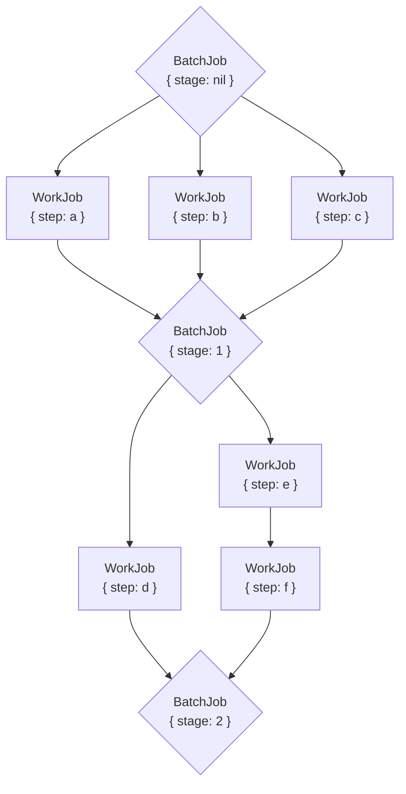

GoodJob Batches let you treat a set of jobs as a unit. When all jobs in a batch have finished — either by completing successfully or by being discarded after exhausting retries — GoodJob enqueues a callback job you define. This makes it straightforward to build fan-out pipelines, multi-stage workflows, and any pattern where downstream work depends on an upstream set completing.

---

## Basic usage

Pass a block to `GoodJob::Batch.enqueue` to add jobs to the batch. The `on_finish:` option names the callback job class that GoodJob enqueues when all jobs have finished.

```ruby
GoodJob::Batch.enqueue(on_finish: MyBatchCallbackJob, user: current_user) do
  MyJob.perform_later
  OtherJob.perform_later
end
```

The callback job receives two arguments — the batch object and a context hash — and must accept them in `perform`:

```ruby
class MyBatchCallbackJob < ApplicationJob
  def perform(batch, context)
    # Batch properties are available and mutable
    batch.properties[:user]  # => <User id: 1, ...>

    # The event that triggered this callback
    context[:event]  # => :finish, :success, or :discard
  end
end
```

---

## Callback events

<AccordionGroup>
  <Accordion title=":finish — all jobs done">
    Enqueued once every job in the batch has reached a terminal state (succeeded or discarded,
    after all retries). This fires regardless of whether jobs succeeded or failed.

    ```ruby
    batch.on_finish = "MyBatchCallbackJob"
    ```
  </Accordion>

  <Accordion title=":success — all jobs succeeded">
    Enqueued only when every job in the batch has succeeded without being discarded.

    ```ruby
    batch.on_success = "MyBatchCallbackJob"
    ```
  </Accordion>

  <Accordion title=":discard — first job discarded">
    Enqueued immediately the first time any job in the batch is discarded. This fires before the
    batch finishes, so other jobs may still be running or queued at the time of the callback.

    ```ruby
    batch.on_discard = "MyBatchCallbackJob"
    ```
  </Accordion>
</AccordionGroup>

You can register different job classes for each event, or the same class for all three — the `context[:event]` argument tells the job which event fired.

---

## Batch attributes

<ParamField path="description" type="String">
  A human-readable label for the batch, visible in the GoodJob Dashboard.
</ParamField>

<ParamField path="on_finish" type="String | Class">
  Job class to enqueue when all jobs have finished (succeeded or discarded).
</ParamField>

<ParamField path="on_success" type="String | Class">
  Job class to enqueue when all jobs have finished successfully.
</ParamField>

<ParamField path="on_discard" type="String | Class">
  Job class to enqueue when the first job in the batch is discarded.
</ParamField>

<ParamField path="callback_queue_name" type="String">
  Queue to use for callback jobs. Defaults to the callback job class's configured queue.
</ParamField>

<ParamField path="callback_priority" type="Integer">
  Priority for callback jobs. Defaults to the callback job class's configured priority.
</ParamField>

<ParamField path="properties" type="Hash">
  Arbitrary data attached to the batch. Serialized using Active Job serialization, so
  GlobalID-compatible objects (like ActiveRecord models) are stored by reference.

  Properties are **mutable** — you can update them from within a callback job and call
  `batch.save` to persist changes.
</ParamField>

---

## Building batches incrementally

Use `GoodJob::Batch.new` and `batch.add` to build a batch across multiple steps before sealing it with `batch.enqueue`. Jobs added via `add` begin performing immediately; the callback job is not enqueued until `enqueue` is called.

```ruby
batch = GoodJob::Batch.new
batch.description = "My batch"
batch.on_finish = MyBatchCallbackJob

batch.add do
  10.times { MyJob.perform_later }
end

batch.add do
  10.times { OtherJob.perform_later }
end

# Seal the batch and set a property in one call
batch.enqueue(on_finish: MyBatchCallbackJob, age: 42)
```

You can also set attributes directly before calling `enqueue`:

```ruby
batch = GoodJob::Batch.new
batch.description = "Nightly export"
batch.on_finish = "ExportCallbackJob"
batch.callback_queue_name = "callbacks"
batch.callback_priority = 10
batch.properties = { report_date: Date.today }
batch.add { ExportJob.perform_later }
batch.enqueue
```

---

## Accessing the batch from within a job

Include `GoodJob::ActiveJobExtensions::Batches` in any job class that is part of a batch to access the batch object during `perform`.

```ruby
class MyJob < ApplicationJob
  include GoodJob::ActiveJobExtensions::Batches

  def perform
    # Access the batch this job belongs to
    self.batch  # => <GoodJob::Batch id: "...", ...>

    # Add more jobs to the same batch dynamically
    batch.add { AnotherJob.perform_later } if some_condition?
  end
end
```

<Note>
  `batch.add` inside a running job appends jobs to the existing batch without resetting the
  callback trigger. Use this — rather than re-calling `batch.enqueue` — to avoid prematurely
  firing callbacks.
</Note>

---

## Complex multi-stage workflows

Batches can model fan-out/fan-in patterns where parallel work feeds into a serial next stage. A single callback job acts as both the batch callback and the orchestrator for the next stage.



Implement this with a single mutable batch and a callback job that checks the current stage:

```ruby
class WorkJob < ApplicationJob
  include GoodJob::ActiveJobExtensions::Batches

  def perform(step)
    # ... do work ...

    # Dynamically add a follow-on job to the same batch
    if step == "e"
      batch.add { WorkJob.perform_later("f") }
    end
  end
end

class BatchJob < ApplicationJob
  def perform(batch, context)
    if batch.properties[:stage].nil?
      batch.enqueue(stage: 1) do
        WorkJob.perform_later("a")
        WorkJob.perform_later("b")
        WorkJob.perform_later("c")
      end
    elsif batch.properties[:stage] == 1
      batch.enqueue(stage: 2) do
        WorkJob.perform_later("d")
        WorkJob.perform_later("e")
      end
    elsif batch.properties[:stage] == 2
      # Final stage — all work complete
    end
  end
end

# Kick off the workflow
GoodJob::Batch.enqueue(on_finish: BatchJob)
```

Calling `batch.enqueue(stage: 1)` from within the callback job updates `properties[:stage]` and re-registers `BatchJob` as the `on_finish` callback for the newly added jobs.

---

## Batch state methods

```ruby
batch = GoodJob::Batch.find(batch.id)

batch.enqueued?      # true after batch.enqueue has been called
batch.finished?      # true when all jobs have reached a terminal state
batch.succeeded?     # true when finished and no jobs were discarded
batch.discarded?     # true when at least one job was discarded

batch.finished_at    # DateTime when the batch finished, or nil
batch.discarded_at   # DateTime of first discard, or nil

batch.active_jobs    # Array of ActiveJob::Base instances in this batch

batch.description = "Updated"
batch.save
batch.reload
```

---

## Important caveats

<AccordionGroup>
  <Accordion title="Callback re-triggering on re-enqueue">
    Calling `batch.enqueue` again on an already-enqueued batch resets the finished/discarded
    state and re-registers callbacks for the newly added jobs. This is intentional for multi-stage
    workflows. Use `batch.add` when you want to add jobs **without** resetting the callback
    trigger.
  </Accordion>

  <Accordion title="Callbacks fire even on empty batches">
    If you call `batch.enqueue` with no jobs in the block, GoodJob still evaluates the finished
    condition immediately and may enqueue the callback job right away.
  </Accordion>

  <Accordion title="Concurrent callback execution">
    The `:finish` and `:success` (or `:discard`) callback jobs can be enqueued and perform
    **concurrently**. If your callback jobs update shared state on the batch's `properties`,
    guard against race conditions — for example by using database-level locking or making
    updates idempotent.
  </Accordion>

  <Accordion title="GlobalID serialization of properties">
    Batch `properties` are serialized using Active Job's serializer, which stores ActiveRecord
    models by their GlobalID reference. If the record is deleted before the callback job runs,
    deserialization will raise an error. Store plain IDs when the record's continued existence
    cannot be guaranteed.
  </Accordion>

  <Accordion title="Batches are a work in progress">
    The Batches API is marked as a work in progress. The interface is stable and production-ready
    for the patterns documented here, but additional capabilities may be added in future releases.
  </Accordion>
</AccordionGroup>
